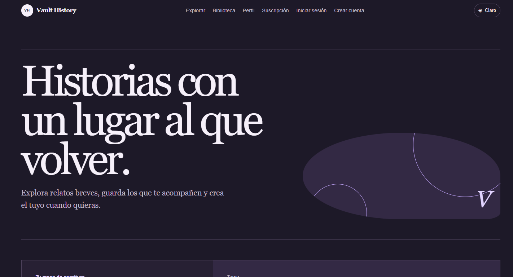
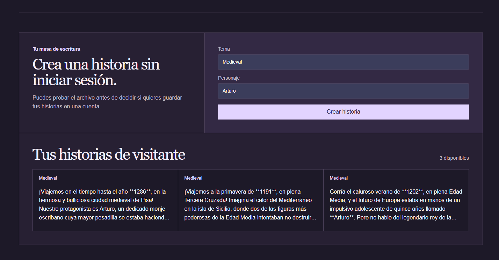
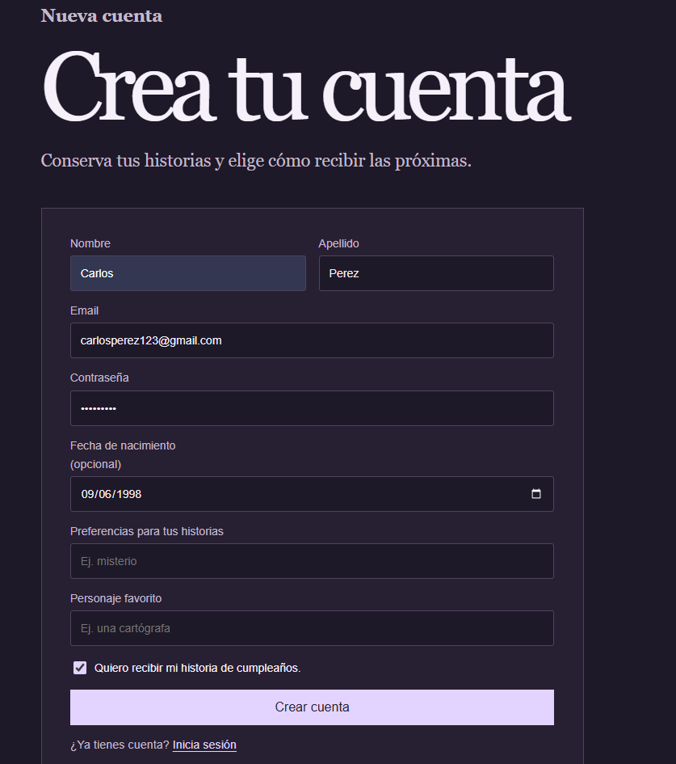
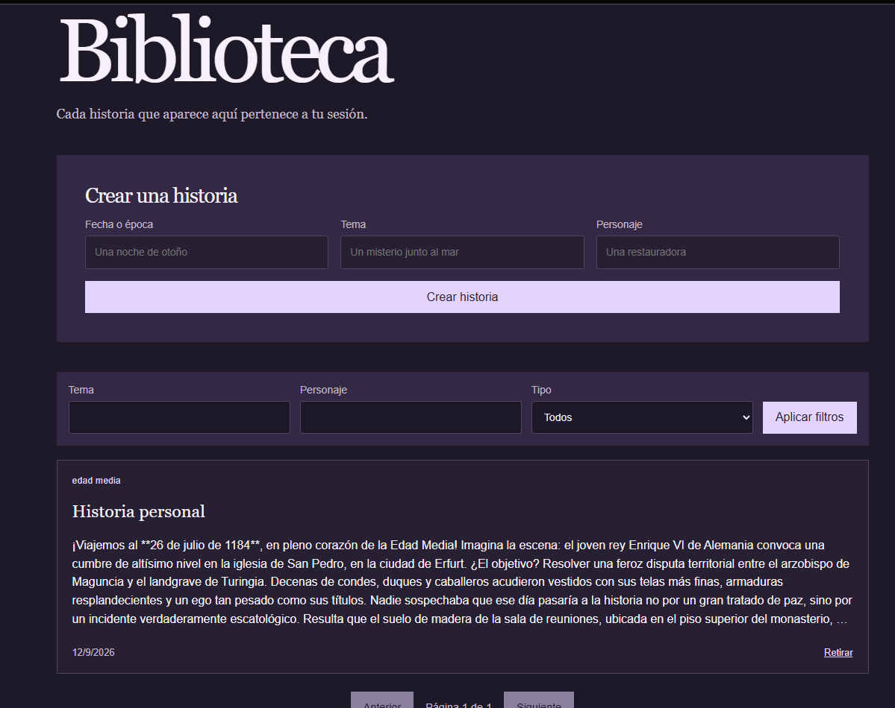

# Vault History System

Vault History System is a local portfolio workspace for Vault History. This repository owns the Docker Compose topology, shared Dockerfiles, configuration examples, and architecture documentation. It is designed for local execution, not production deployment.

## Architecture


The image uses GitHub's raw-content URL so that it renders reliably in the repository README. It is generated from the Compose-backed architecture specification. Explore the [interactive diagram](docs/architecture/backend-architecture.html) or inspect its [editable Archify JSON source](docs/architecture/backend-architecture.archify.json) for labels, relationships, and focused views.

The backend topology is:

1. The **Frontend** calls **User** over HTTPS for accounts and authentication, and calls History through server-side routes.
2. **User** stores account and outbox data in **PostgreSQL**. **History** stores generated stories in **MongoDB** and asks **Google Gemini** to generate a story only when requested.
3. **Jobs** publishes notification work to **Apache Kafka**. **Notification** consumes that work, obtains subscription stories from History when needed, sends email through the **Gmail API**, and publishes correlated outcomes.

| Component | Responsibility | Primary integration |
| --- | --- | --- |
| Frontend | Next.js visitor, account, library, and subscription experience | Server-side routes to User and History |
| User | Accounts, authentication, preferences, and transactional outbox | PostgreSQL and Kafka-oriented outbox processing |
| History | Story generation and persistence | MongoDB and Google Gemini |
| Jobs | Scheduled selection, outbox processing, and result coordination | PostgreSQL and Apache Kafka |
| Notification | Template rendering and email delivery | Apache Kafka, History, PostgreSQL checkpoints, and Gmail |
| PostgreSQL | User, outbox, and notification-checkpoint data | User owns the EF Core migration for the shared checkpoint table |
| MongoDB | Generated-story data | History |
| Apache Kafka | Asynchronous notification contracts | Jobs and Notification |

The Frontend is part of the portfolio workspace, but it is started separately from the backend Compose file.

## Repositories

Each project keeps its own source code, tests, and Git history. Clone all of them into one parent directory with the exact names below.

| Project | Repository | Local directory |
| --- | --- | --- |
| Orchestration | <a href="https://github.com/CarlosSV923/Vault.History.System" target="_blank" rel="noopener noreferrer">CarlosSV923/Vault.History.System</a> | `Vault.History.System` |
| Frontend | <a href="https://github.com/CarlosSV923/VaultHistory.Frontend.Museum" target="_blank" rel="noopener noreferrer">CarlosSV923/VaultHistory.Frontend.Museum</a> | `VaultHistory.Frontend.Museum` |
| User | <a href="https://github.com/CarlosSV923/VaultHistory.Microservice.User" target="_blank" rel="noopener noreferrer">CarlosSV923/VaultHistory.Microservice.User</a> | `VaultHistory.Microservice.User` |
| Jobs | <a href="https://github.com/CarlosSV923/VaultHistory.Microservice.Jobs" target="_blank" rel="noopener noreferrer">CarlosSV923/VaultHistory.Microservice.Jobs</a> | `VaultHistory.Microservice.Jobs` |
| History | <a href="https://github.com/CarlosSV923/VaultHistory.Microservice.History" target="_blank" rel="noopener noreferrer">CarlosSV923/VaultHistory.Microservice.History</a> | `VaultHistory.Microservice.History` |
| Notification | <a href="https://github.com/CarlosSV923/VaultHistory.Microservice.Notification" target="_blank" rel="noopener noreferrer">CarlosSV923/VaultHistory.Microservice.Notification</a> | `VaultHistory.Microservice.Notification` |

Work is planned in the <a href="https://github.com/users/CarlosSV923/projects/3" target="_blank" rel="noopener noreferrer">Portfolio Vault History System GitHub Project</a>.

## Required local workspace layout

All repositories must be siblings in the same parent directory. This is required because the Compose build contexts use the relative paths `../VaultHistory.Microservice.*`.

```text
vault-history-local/
├── Vault.History.System/
├── VaultHistory.Frontend.Museum/
├── VaultHistory.Microservice.User/
├── VaultHistory.Microservice.Jobs/
├── VaultHistory.Microservice.History/
└── VaultHistory.Microservice.Notification/
```

Do not place the service repositories inside `Vault.History.System` and do not rename their directories. A different layout makes `docker compose up --build` fail because Docker cannot resolve its build contexts.

### Clone the complete local workspace

From Git Bash, macOS, or Linux, run:

```bash
mkdir vault-history-local
cd vault-history-local

git clone https://github.com/CarlosSV923/Vault.History.System.git Vault.History.System
git clone --branch develop https://github.com/CarlosSV923/VaultHistory.Frontend.Museum.git VaultHistory.Frontend.Museum
git clone --branch develop https://github.com/CarlosSV923/VaultHistory.Microservice.User.git VaultHistory.Microservice.User
git clone --branch develop https://github.com/CarlosSV923/VaultHistory.Microservice.Jobs.git VaultHistory.Microservice.Jobs
git clone --branch develop https://github.com/CarlosSV923/VaultHistory.Microservice.History.git VaultHistory.Microservice.History
git clone --branch develop https://github.com/CarlosSV923/VaultHistory.Microservice.Notification.git VaultHistory.Microservice.Notification

cd Vault.History.System
```

For PowerShell:

```powershell
New-Item -ItemType Directory -Force vault-history-local | Out-Null
Set-Location vault-history-local

git clone https://github.com/CarlosSV923/Vault.History.System.git Vault.History.System
git clone --branch develop https://github.com/CarlosSV923/VaultHistory.Frontend.Museum.git VaultHistory.Frontend.Museum
git clone --branch develop https://github.com/CarlosSV923/VaultHistory.Microservice.User.git VaultHistory.Microservice.User
git clone --branch develop https://github.com/CarlosSV923/VaultHistory.Microservice.Jobs.git VaultHistory.Microservice.Jobs
git clone --branch develop https://github.com/CarlosSV923/VaultHistory.Microservice.History.git VaultHistory.Microservice.History
git clone --branch develop https://github.com/CarlosSV923/VaultHistory.Microservice.Notification.git VaultHistory.Microservice.Notification

Set-Location Vault.History.System
```

The repositories are intentionally cloned independently. Before running Compose, use `git status` in each one if you need to confirm the local sources match the revisions you intend to demonstrate.

## Run the backend locally

### Prerequisites

- Git.
- Docker Desktop with Docker Compose.
- Approximately 6 GB of available memory for the backend services and infrastructure.

Create local configuration from the example:

```bash
cp .env.example .env
```

Then build and start the complete backend from `Vault.History.System`:

```bash
docker compose up --build -d
```

Check status and logs:

```bash
docker compose ps
docker compose logs --tail 100 user history jobs notification kafka-init
```

Stop the environment:

```bash
docker compose down
```

Do not run `docker compose down --volumes` unless you intentionally want to remove local PostgreSQL, MongoDB, and Kafka data.

## Run the Frontend separately

The Docker Compose file starts the backend only. Start the Next.js Frontend from its own sibling repository after the User and History containers are healthy; otherwise the Frontend's server-side routes cannot reach their APIs.

Run the workspace in this order:

1. Clone the complete workspace and open `Vault.History.System`.
2. Create `.env` and run `docker compose up --build -d`.
3. Wait for User and History to report healthy with `docker compose ps`.
4. Open `VaultHistory.Frontend.Museum`, install its dependencies, create `.env.local`, and start Next.js.
5. Open `http://localhost:3000` in a browser.

From `Vault.History.System`, start the backend and wait for its APIs:

```bash
cp .env.example .env
docker compose up --build -d
docker compose ps
```

Then, from the Frontend repository, run:

```bash
cd ../VaultHistory.Frontend.Museum
corepack enable
pnpm install --frozen-lockfile
cp .env.example .env.local
pnpm dev
```

Set these values in `VaultHistory.Frontend.Museum/.env.local` for the local Compose environment:

```dotenv
USER_API_URL=http://localhost:5000
HISTORY_API_URL=http://localhost:3001
HISTORY_FRONTEND_TOKEN=local-history-frontend-token
```

The URLs and token are consumed only by the Frontend's server-side routes. Do not rename them with a `NEXT_PUBLIC_` prefix and do not expose the token in browser code.

## Product walkthrough

The following local screenshots show the visitor landing page, anonymous story generation, and the signed-in library experience.

### Visitor landing page



### Anonymous story generation



### Account creation



### Personal library



## Compose topology and configuration

`compose.yaml` builds User, History, Jobs, and Notification from their sibling repositories with the Dockerfiles stored in this repository. It also starts PostgreSQL, MongoDB, Kafka, and the idempotent `kafka-init` topic initializer. Docker service names provide internal DNS; workers use `kafka:9092`, and Notification reaches History at `http://history:3000`.

The example configuration declares local-only values for PostgreSQL, MongoDB, JWT signing, the internal History token, and anonymous-generation settings. `AUTH_TOKEN_FORNT` is the existing History configuration key; `ANONYMOUS_DAILY_LIMIT` defaults to `3`.

Google settings are placeholders so containers can start before a real story or email is processed. Set `GOOGLE_API_KEY` only for Gemini-backed generation, and set the Gmail client, sender, and refresh-token variables only for real delivery. Keep `.env` out of Git and never publish `docker compose config` output created with real secrets, because Compose expands them.

### Keep shared local settings aligned

The root `.env` is the editable source for the containers started by Compose. If you run a sibling repository outside Compose, mirror its integration values in that repository's local configuration; otherwise the services may start but reject each other's requests.

| Root `.env` variable | Matching local configuration | Rule |
| --- | --- | --- |
| `AUTH_TOKEN_FORNT` | History `AUTH_TOKEN_FORNT` and Frontend `HISTORY_FRONTEND_TOKEN` | All three values must be identical. The spelling `FORNT` is an existing History configuration key and must not be renamed. |
| `HISTORY_AUTH_TOKEN` | History `AUTH_TOKEN_JOB` and Notification `History__AuthorizationToken` | Keep the same value for the protected Notification-to-History subscription call. |
| `JWT_PRIVATE_KEY` | User `Jwt__PrivateKey` and History `JWT_SECRET` | Keep the signing and validation secrets aligned; keep the configured issuer and audience aligned as well. |

The URL values use different addresses by design: the standalone Frontend uses `http://localhost:5000` and `http://localhost:3001`, while containers use service DNS such as `http://history:3000`. Change only the address appropriate to the process that makes the call.

## Messaging and state

`kafka-init` creates these topics before Jobs and Notification start:

- `notify-history-topic`
- `notify-outbox-topic`
- `update-users-topic`
- `update-outbox-topic`

For registration, User records a `CreateUserEvent` in its outbox, Jobs publishes correlated work to `notify-outbox-topic`, and Notification publishes the matching `{ id: outboxId, data: ... }` outcome to `update-outbox-topic` only after delivery processing. The existing legacy `UserId.Value` payload remains compatible. Sign-in notifications follow the same correlated outbox path with their specific template.

PostgreSQL notification checkpoints allow History-message retries to reuse a generated story and a confirmed-email stage before a Kafka result is republished. The documented design is at-least-once around external email delivery; it does not claim an end-to-end exactly-once guarantee.

## Local ports and diagnostics

| Service | Address |
| --- | --- |
| User API | `http://localhost:5000` |
| User health check | `http://localhost:5000/health` |
| History API | `http://localhost:3001` |
| Kafka | `localhost:9094` |
| PostgreSQL | `localhost:5432` |
| MongoDB | `localhost:27017` |

Jobs and Notification are workers and do not expose HTTP ports. If a worker restarts, inspect Kafka and the resolved configuration first:

```bash
docker compose logs kafka kafka-init jobs notification
docker compose config
```

If User fails while applying migrations, inspect PostgreSQL before restarting User and Jobs:

```bash
docker compose logs postgres user
docker compose restart user jobs
```

## Repository layout

```text
Vault.History.System/
├── compose.yaml
├── docker/
│   ├── user.Dockerfile
│   ├── jobs.Dockerfile
│   ├── history.Dockerfile
│   └── notification.Dockerfile
├── docs/
│   └── architecture/
│       ├── backend-architecture.png
│       ├── backend-architecture.html
│       └── backend-architecture.json
└── .env.example
```

Source code lives in the sibling repositories listed above.

## Verification and scope

Run `docker compose config --quiet` to validate the Compose configuration before a build. The Docker Compose environment is intentionally for local portfolio demonstrations; it is not a production deployment guide.
