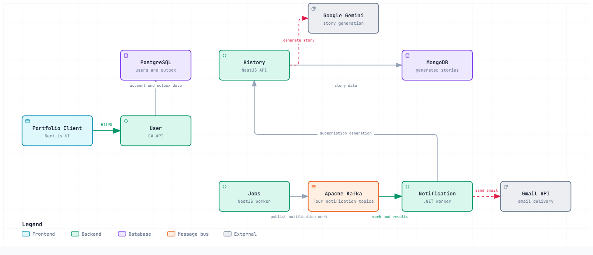

# Vault History System

Vault History System is the integration and architecture repository for the Vault History portfolio backend. It documents how the independently maintained services, data stores, message broker, and external providers fit together.

This repository deliberately contains **no service source code, submodules, or `services/` directory**. The service repositories are connected only through the links in this document. That separation keeps ownership, tests, releases, and source history with each service.

## Architecture



The diagram is a static export of the versioned architecture source. Explore the [interactive diagram](docs/architecture/backend-architecture.html) or inspect its [editable JSON source](docs/architecture/backend-architecture.json) for labels, relationships, and focused views.

The backend topology is:

1. The portfolio client calls **User** over HTTPS for accounts and authentication.
2. **User** stores account and outbox data in **PostgreSQL**. **History** stores generated stories in **MongoDB** and asks **Google Gemini** to generate a story only when requested.
3. **Jobs** publishes notification work to **Apache Kafka**. **Notification** consumes that work, obtains subscription stories from History when needed, sends email through the **Gmail API**, and publishes correlated outcomes.

| Component | Responsibility | Primary integration |
| --- | --- | --- |
| User | Accounts, authentication, preferences, and transactional outbox | PostgreSQL and Kafka-oriented outbox processing |
| History | Story generation and persistence | MongoDB and Google Gemini |
| Jobs | Scheduled selection, outbox processing, and result coordination | PostgreSQL and Apache Kafka |
| Notification | Template rendering and email delivery | Apache Kafka, History, PostgreSQL checkpoints, and Gmail |
| PostgreSQL | User, outbox, and notification-checkpoint data | User owns the EF Core migration for the shared checkpoint table |
| MongoDB | Generated-story data | History |
| Apache Kafka | Asynchronous notification contracts | Jobs and Notification |

The frontend is not part of this repository or its Compose topology.

## Service repositories

Clone, build, test, and release each service in its own repository. This is the only source-level connection from this repository to those projects.

| Service | Repository |
| --- | --- |
| User | [CarlosSV923/VaultHistory.Microservice.User](https://github.com/CarlosSV923/VaultHistory.Microservice.User) |
| Jobs | [CarlosSV923/VaultHistory.Microservice.Jobs](https://github.com/CarlosSV923/VaultHistory.Microservice.Jobs) |
| History | [CarlosSV923/VaultHistory.Microservice.History](https://github.com/CarlosSV923/VaultHistory.Microservice.History) |
| Notification | [CarlosSV923/VaultHistory.Microservice.Notification](https://github.com/CarlosSV923/VaultHistory.Microservice.Notification) |

Work is planned in the [Portfolio Vault History System GitHub Project](https://github.com/users/CarlosSV923/projects/3). The original orchestration task is [HU-12](https://github.com/CarlosSV923/Vault.History.System/issues/1); its follow-up improvements remain tracked in [HU-26](https://github.com/CarlosSV923/Vault.History.System/issues/12).

## Compose topology and current limitation

`compose.yaml` and the Dockerfiles preserve the documented backend topology: User, History, Jobs, Notification, PostgreSQL, MongoDB, Kafka, and the idempotent `kafka-init` topic initializer. Docker service names provide internal DNS; the workers use `kafka:9092`, and Notification reaches History at `http://history:3000`.

Because this repository no longer vendors service source trees, a clean checkout does **not** contain the build contexts referenced by `compose.yaml`. Consequently, `docker compose up --build` is not a runnable full-stack command from this repository alone. Do not mistake the retained Compose configuration for a production-validated deployment. Restoring a reproducible, runnable orchestration without reintroducing service source directories is an explicit future integration decision, not part of this documentation change.

You can still inspect the resolved configuration without starting containers:

```bash
docker compose config --quiet
```

If you have a separately prepared local integration workspace, the retained operational commands are:

```bash
docker compose ps
docker compose logs --tail 100 user history jobs notification kafka-init
docker compose down
```

Do not run `docker compose down --volumes` unless you intentionally want to remove local PostgreSQL, MongoDB, and Kafka data.

## Configuration

Copy the example file only in an integration workspace that supplies compatible service build contexts:

```bash
cp .env.example .env
```

The example declares local-only values for PostgreSQL, MongoDB, JWT signing, the internal History token, and anonymous-generation settings. `AUTH_TOKEN_FORNT` is the existing History configuration key; `ANONYMOUS_DAILY_LIMIT` defaults to `3`.

Google settings are placeholders so containers can start before a real story or email is processed. Set `GOOGLE_API_KEY` only for Gemini-backed generation, and set the Gmail client, sender, and refresh-token variables only for real delivery. Keep `.env` out of Git and never publish `docker compose config` output created with real secrets, because Compose expands them.

## Messaging and state

`kafka-init` creates these topics before Jobs and Notification start:

- `notify-history-topic`
- `notify-outbox-topic`
- `update-users-topic`
- `update-outbox-topic`

For registration, User records a `CreateUserEvent` in its outbox, Jobs publishes correlated work to `notify-outbox-topic`, and Notification publishes the matching `{ id: outboxId, data: ... }` outcome to `update-outbox-topic` only after delivery processing. The existing legacy `UserId.Value` payload remains compatible. Sign-in notifications follow the same correlated outbox path with their specific template.

PostgreSQL notification checkpoints allow History-message retries to reuse a generated story and a confirmed-email stage before a Kafka result is republished. The documented design is at-least-once around external email delivery; it does not claim an end-to-end exactly-once guarantee.

Anonymous generation is configured through History's fixed frontend token and daily limit. The quota behavior that relies on an IP supplied in the request body is documented as the currently integrated service behavior; the hardened visitor-attribution work is tracked separately and must not be inferred from this repository.

## Local ports and diagnostics

When the Compose stack is supplied with valid service sources, these host ports are configured:

| Service | Address |
| --- | --- |
| User API | `http://localhost:5000` |
| User health check | `http://localhost:5000/health` |
| History API | `http://localhost:3001` |
| Kafka | `localhost:9094` |
| PostgreSQL | `localhost:5432` |
| MongoDB | `localhost:27017` |

Jobs and Notification are workers and do not expose HTTP ports. If a worker restarts, inspect Kafka and the resolved configuration first:

```bash
docker compose logs kafka kafka-init jobs notification
docker compose config
```

If User fails while applying migrations, inspect PostgreSQL before restarting User and Jobs:

```bash
docker compose logs postgres user
docker compose restart user jobs
```

## Repository layout

```text
Vault.History.System/
├── compose.yaml
├── docker/
│   ├── user.Dockerfile
│   ├── jobs.Dockerfile
│   ├── history.Dockerfile
│   └── notification.Dockerfile
├── docs/
│   └── architecture/
│       ├── backend-architecture.png
│       ├── backend-architecture.html
│       └── backend-architecture.json
└── .env.example
```

There is no `services/` directory and no Git submodule configuration. The Dockerfiles and Compose file belong to this orchestration repository; service implementation, tests, and specialized documentation remain in the linked repositories.

## Verification and scope

This repository has no application test suite. For this documentation, verify relative links against the files above, run `docker compose config --quiet` only as configuration validation, and visually inspect the rendered README and architecture image on GitHub.

This documentation does not change application behavior, service contracts, secrets, Docker infrastructure, provider credentials, or functional validation. In particular, it does not close HU-26, replace the independent HU-20 functional validation, or present pending work as implemented.
